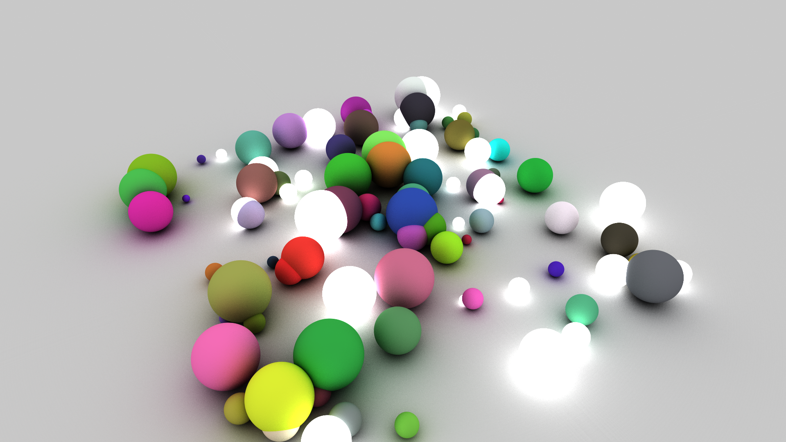

# Rabbit

This project is a simple implementation of a path tracer that uses OpenCL.
The current implementation is very simple since it was done to try if the architecture ideas and kernel configuration was valid.
The focus is on a proper structure that could be extented by adding some more features to the renderer.
The system only supports spheres as geometry, has no acceleration structure and has only two materials: diffuse and emitting.

Please note that the code also works on CPUs but it's aimed at GPUs since data is structured using SOA layout.

Below is an output image of the system rendering 100 random spheres.
The image resolution is 1920x1080 and was rendered in ~26 seconds on a NVIDIA GTX 1070 using 1024 samples for each pixel.

